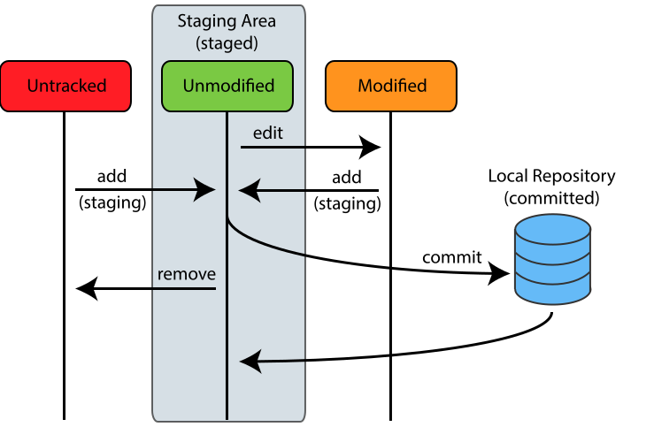
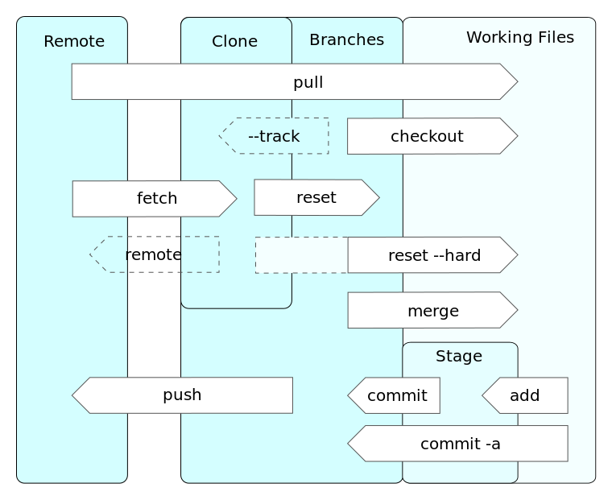

本文为《手机平台应用开发(MAD)》课程、《服务计算(SCOC)》的作业，学习Git以及总结Git日常使用命令等。

<!-- more -->

## 前言

在大一的时候，曾经写过一篇叫《Git系列：GitHub入门》的文章，当初刚刚接触Git和GitHub，所写的东西很多都比较简单，涉及的内容也不多。由于网上的Git教程很多都是从零开始说起，讲了很多知识点之后才涉及到诸如GitHub等托管服务商，而当初的我自认为Git教程从实用性上而言应该结合托管服务来教学。

不过，由于作业要求为总结Git日常使用的常用命令、步骤等信息，那本文将不会把重点放在托管服务上。

## 什么是Git？

Git是一个免费的、开源的分布式版本控制系统，最初由Linus编写。Git是程序员领域最受欢迎的版本控制系统，是团队工作维护版本分支、整合代码的工具，每个程序员都有必要学习Git的使用。

作为一个分布式版本控制系统，Git的代码仓库不需要服务端软件，就可以运作版本控制，项目代码仓库的每个拷贝均可以独立工作。但是为了让版本控制更加方便，很多公司提供了Git的代码仓库托管服务，比如[GitHub](https://github.com/)、[GitLab](https://about.gitlab.com/)、[码云](https://gitee.com/)等。GitHub是最大的Git仓库托管服务商，没有之一；GitLab提供了一套Git仓库托管服务管理的工具，让人们能直接搭建属于自己的Git仓库托管网站，同时本身也提供托管服务；码云是开源中国建立的托管服务平台。除了仓库托管之外，大部分的平台都会提供类似于Issue、Wiki、Release等功能，同时也会跟CI大厂合作，向开发者提供持续集成等功能。

本文实验托管平台采用码云，但是建议GitHub。

### 安装Git

前往[Git官网](https://git-scm.com/)，选择适合自己系统的版本下载并安装。Linux系统也可直接利用yum或apt等软件包管理软件安装。

Windows安装过程需要选择命令行风格、默认文本编辑器等，如果不知道该如何设置请保持默认。

安装完成之后，在桌面或者资源管理器中右键鼠标，会发现多了两个菜单项：`Git GUI Here`、`Git Bash Here`。前者是Git提供的GUI管理界面，后者是类似于PowerShell的控制台终端。即使是使用Git命令，也不一定需要Git Bash。

打开Git Bash或者PowerShell，检查Git版本。

```sh
$ git version
```

### 注册托管平台账号

Git通过一个人的用户名和邮箱来标识提交代码的所有人，因此建议注册的账号的用户名和邮箱，跟本地提交的用户名和邮箱保持一致。

## Git基本使用

### 配置全局用户

在使用Git之前，需要配置用户名和邮箱。Git提供`git config`命令，专门用来配置或读取相应的工作环境变量，但实际上是调用了一个叫`git-config`的程序。Git的所有命令都有独立的程序负责，这些程序在`Git/mingw64/libexec/git-core/`文件夹中。

```sh
$ git config --global user.name "your_username"
$ git config --global user.email "your_email"
```

通过`git config`查看全部配置信息，以确保配置成功。

```sh
$ git config --list
```

也可以查看某个环境变量。

```sh
$ git config user.name
```

配置环境变量时，如果用了`--global`参数，那就表示更改的配置文件位于用户目录，作为所有项目的默认配置文件。去掉`--global`可以让该更改仅针对当前仓库，新的设定保存在当前仓库的`.git/config`文件里。

### 初始化仓库

可使用`init`命令将当前目录初始化为代码仓库。

```sh
$ git init
```

该命令将创建一个名为`.git`的子目录，在目录中存储仓库的配置文件和版本库数据。在当前目录不为空的情况亦可初始化成功，但是已存在的文件还没有被跟踪。

也可以通过新建仓库的方式初始化。

```sh
$ git init [project_folder]
```

### 工作区和版本库

Git的版本控制仓库中有三个区域，工作区(working tree)、暂存区(staging area)、本地仓库(local repository)。

* 本地仓库是Git存储项目的元数据和对象数据库的地方，存储在仓库中的`.git`文件夹中，通过`commit`命令对该区域进行修改。
* 工作区是仓库某个版本的副本，存放在仓库中的根目录非`.git`文件夹中，直接修改硬盘本地的文件即可对该区域进行修改。
* 暂存区是即将加入本地仓库的、经过修改的数据，通过`add`、`rm`、`commit`等命令对该区域修改。

### 文件状态与命令

一个文件的状态有**未追踪(untracked)**、**已修改(modified)**、**暂存(staged)**、**已提交(committed)**，Git的基本工作就是管理不同状态的文件。一个新创建的文件属于未追踪状态，处于仓库的工作区；新创建的文件可以通过`add`命令从未追踪状态切换为暂存状态；暂存状态的文件可以通过`commit`命令添加进本地仓库中，状态将被视为已提交；已提交的文件的副本在工作区中被修改时，将被视为已修改；已修改的文件可以通过`add`命令再次进入暂存状态，等待提交。



（图片来源：[Git Tutorial | The Three States and Areas | Code Snipcademy](https://code.snipcademy.com/tutorials/git/fundamentals/three-states-areas)）

查看当前Git仓库工作区文件状态，可知工作区是否有文件需要被追踪、暂存或提交。

```sh
$ git status
```

将未追踪或已修改的文件加入暂存区，可通过`-A`参数将所有符合条件的文件加入暂存区。

```sh
$ git add [file_name_1] [file_name_2]

$ git add [directory_name]

$ git add -A
```

修改已提交文件的文件名，并将该修改加入暂存区。

```sh
$ git mv [source_file_name] [destination_file_name]
```

删除已提交的文件，带`--cached`参数可将文件从暂存区中移除，但仍保留在工作区中，即未追踪状态。

```sh
$ git rm [file_name_1] [file_name_2]

$ git rm --cached [file_name]
```

提交暂存区中的所有文件，通过`-m`指定提交信息。如果不带`-m`参数，将打开默认文本编辑器(现在Git默认VS Code)编写提交信息。通常情况下，Git通过空行来识别区别提交信息的标题和具体内容。在提交信息过多的时候，我们建议写一行标题、一行空行、多行具体内容，提交信息不多的情况下可以选择只保留标题。

```sh
$ git commit -m "commit message here"

$ git commit
```

查看每次提交版本日志，`log`命令定制功能很强大，可以自定义属于自己的日志查询。

```sh
$ git log

$ git log --graph --pretty=oneline --abbrev-commit
```

### 版本回退

版本回退需要获取回退提交记录的哈希索引，该值可通过`log`命令获取。该哈希值很长，回退输入命令的时候只需要该值的前一部分即可。

```sh
$ git reset [--mixed|--hard|--soft] [commit_hash_code]
```

Git中存在指针的概念，每个分支均有一个指针指向当前分支的最新提交记录。同时，`HEAD`指针指向工作区中的提交记录。版本库中的所有提交记录形成树形结构，而`reset`命令可以修改指针的位置。

版本回退有三个模式：

* `--soft`：Git将重置`HEAD`指针和当前分支指针到另外一个提交记录，对工作区和暂存区不做任何操作。
* `--hard`：Git将重置`HEAD`指针和当前分支指针到另外一个提交记录，同时工作区也将更新到该提交记录，暂存区清空。
* `--mixed`(默认模式)：Git将重置`HEAD`指针和当前分支指针到另外一个提交记录，对工作区不做任何操作，但是暂存区清空。

值得注意的是，即使做了版本回退操作，从log树中消失的提交记录依然存在在版本库中。如果我们记得该提交记录的哈希索引，就可以通过`reset`命令取消回退操作。

万一想要回到回退之前的版本，但是又忘记了之前版本的提交记录哈希索引，可以通过`reflog`命令查看`HEAD`指针的变动记录。

```sh
$ git reflog
```

版本回退可以用指针名和`~`标记来简化需要输入哈希索引的过程。`HEAD`是工作区当前提交记录，所以`HEAD~`是上一个提交记录，`HEAD~~`是上上个提交记录。

```sh
$ git reset HEAD~

$ git reset HEAD~~
```

## Git进阶使用



（图片来源：[git - 维基百科，自由的百科全书](https://zh.wikipedia.org/wiki/Git)）

### 远程仓库

Git通常通过远程仓库来进行团队协作，同时托管平台所托管的代码仓库也属于远程仓库的一种。

为了实验的进行，我们在托管平台上创建一个空的仓库，注意，仓库必须为空，不能有任何提交记录。

向本地仓库添加远程仓库的地址，该地址从托管平台上获取。通常情况下，远程仓库名为`origin`。

```sh
$ git remote add https://gitee.com/MegaShow/git-test-project.git
```

`remote`命令将修改`.git/config`中关于远程仓库的设定。

将本地仓库的提交记录上传到远程仓库中。

```sh
$ git push [remote] [branch]
```

第一次提交可以设置上流分支，这样以后上传就可以省略远程仓库名和分支名了。

```sh
$ git push --set-upstream origin master

$ git push -u origin master
```

拉取远程仓库更新的提交记录。

```sh
$ git fetch
```

拉取远程仓库更新的提交记录，并与本地更新合并。

```sh
$ git pull
```

如果在远程仓库中存在一个项目，而本地没有其副本，可以通过`clone`命令来将远程仓库克隆到本地。可通过`https/git`链接克隆，两种链接均由托管远程仓库的平台提供。克隆目标路径可省略，会在当前目录生成与仓库名对应的文件夹。

```sh
$ git clone https://gitee.com/MegaShow/git-test-project.git [directory]

$ git clone git@gitee.com:MegaShow/git-test-project.git [directory]
```

### 分支策略

Git允许仓库中存在多个分支，每个分支对应存在一个提交记录的指针，指针名为分支名。默认的分支为`master`，因此我们显示日志的时候会发现有`master`和`HEAD`两个指针。

```sh
$ git log --graph --pretty=oneline --abbrev-commit
```

显示本地仓库中的分支。

```sh
$ git branch
```

显示远程仓库中的分支。

```sh
$ git branch -r
```

显示本地仓库、远程仓库中的分支。

```sh
$ git branch -a
```

在当前提交记录上新建一个分支。

```sh
$ git branch [branch_name]
```

将工作区切换到某个分支。

```sh
$ git checkout [branch_name]
```

在当前提交记录上新建一个分支，且将工作区切换到该分支。

```sh
$ git checkout -b [branch_name]
```

将指定分支合并到当前分支。

```sh
$ git merge [branch_name]
```

如果合并分支时发生了通知，Git会自动在冲突的地方插入标志性的一长串字符，并提示需要处理冲突。冲突解决之后，需要提交解决冲突的更新。

### Git Ignore

在项目开发过程中，必不可少会生成大量的中间文件、目标文件或临时文件。Git允许指定特殊的文件被过滤掉，不被追踪且不会提交到版本库中，只允许在工作区存在。

这一功能通过`.gitignore`文件来实现，每个`.gitignore`文件可作用于该文件所在目录的所有文件以及所有子目录中的文件。

下面是来自Git官方的例子。

```
# exclude everything except directory foo/bar
/*
!/foo
/foo/*
!/foo/bar
```

值得注意的是，当一个文件已被提交到版本库中，接下来再修改`.gitignore`使得该文件符合过滤条件时，该文件依然存在版本库中。`.gitignore`只会影响工作区和暂存区中的追踪和提交操作，而不会影响原有的版本库中的元数据。

[github/gitignore: A collection of useful .gitignore templates](https://github.com/github/gitignore)是GitHub上著名的`.gitignore`规则项目，如果你发起一个项目的时候，不妨基于该项目所提供的丰富的过滤规则，来创建适合自己项目的过滤规则。

## 结语

关于Git的使用，其实Git官方提供了非常丰富的[教程](https://git-scm.com/book/zh/v2/)，并且支持中文版且支持PDF等版本下载。

实际上，本人平时只会用到`git clone`命令，而对于其它命令我更偏向于学会使用和理解即可的程度，不需要深入研究。因为在我们编程的过程中，更多时候是使用各种工具来实现Git的各种功能，比如VS Code原生对Git的支持就已经满足日常使用了。毕竟，Git就是拿来用的嘛。

