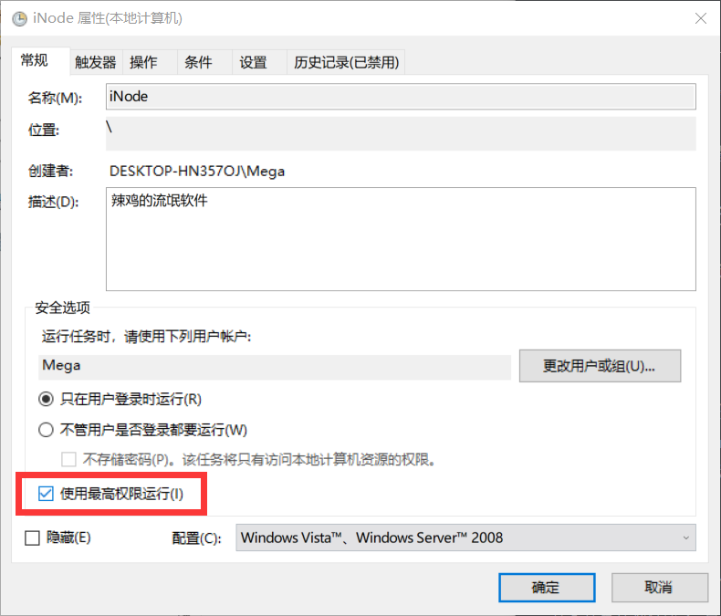

这周跟Zhenly帮两纯洁可爱皮皮电脑重装系统之后，一皮皮突然提出能不能把学校的网络认证软件iNode设置为自启动。我第一反应就是因为iNode需要UAC权限，所以无法设置任务计划。不到一分钟，Zhenly大佬就跳出啪啪啪打我脸。(好疼啊~)

<!-- more -->

## Windows任务计划

什么是Windows任务计划呢？就是在Windows里面创建和管理一些特殊或常用的程序，让它们在特定的情况下执行。

### 进入任务计划程序

这里有两种方式进入任务计划程序，第一种自然是直接搜索`任务计划程序`，然后就能进入设置界面了。第二种是右键`Win`按钮(就是任务栏最左边的开始按钮)，选择`计算机管理`，在计算机管理窗口里面，集成了任务计划程序及其他一些常用的关于计算机管理的工具。

### 创建任务

因为我们只要设置一个简单的自启动项，所以不需要设置多少东西。进入`计算机管理(本地)`-`系统工具`-`任务计划程序`，点击右边的创建任务。

然后常规、触发器、操作按照下面图片设置好，确认创建之后，再重启就可以了。

### 启动时

更新到Windows 1709的小伙伴应该都知道，1709有一个很强的特性，就是在用户未登陆阶段也可以后台自启动程序。以前我们开机输入密码之后还要等一段时间后QQ之类的软件才会自启动，而现在我们开机之后，可以上个厕所，然后回来输入密码之后QQ等软件已经开启好了。

本来我也想设置iNode成这样，但是无奈设置触发器为`启动时`开始任务没有办法执行该任务计划，我现在的想法是，大概这个和用户权限有关，这个程序不知道你密码。到底真的是怎么样呢我也不清楚，坐等Zhenly来告知答案~

在寻求解决方法的时候发现轮子哥说用Windows Services来解决自启动问题，看起来有点高端，有空折腾一下。溜去补作业啦~

(偶然遇到小傅Fox师弟的知乎回答~)(逃~

